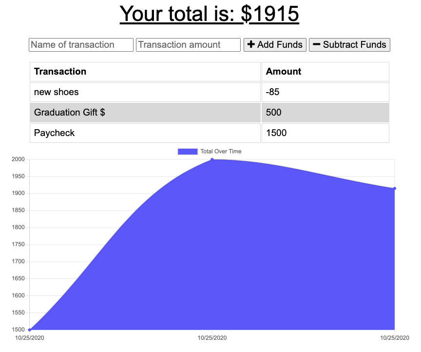
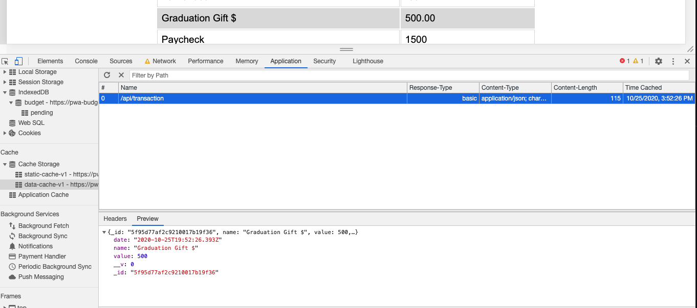
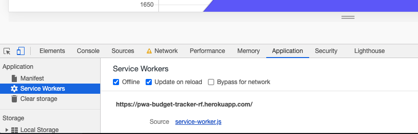
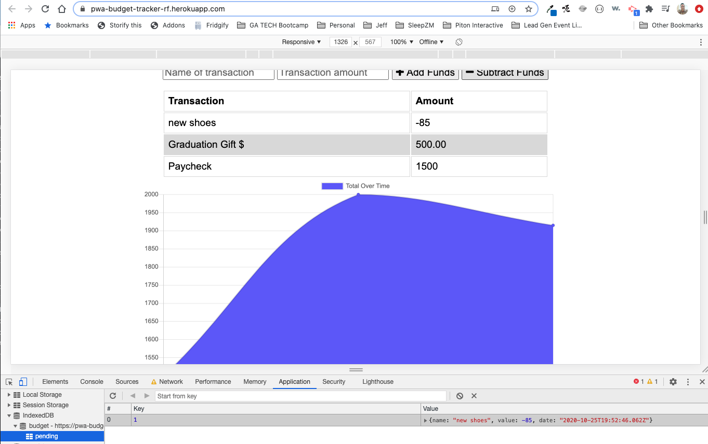
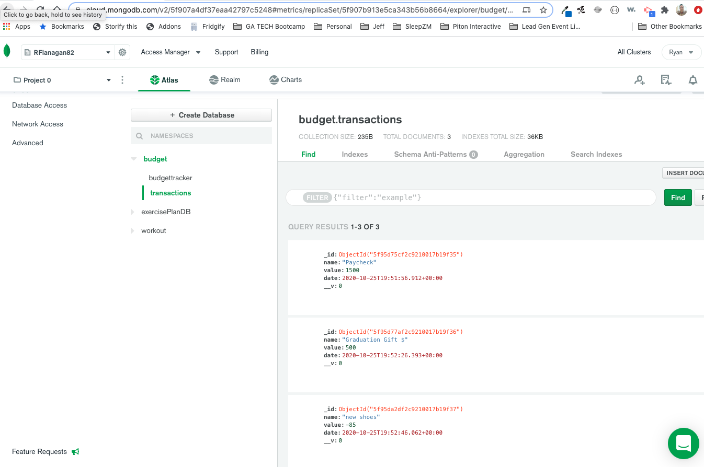
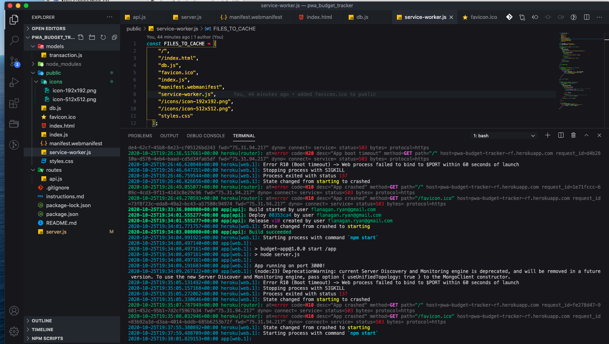
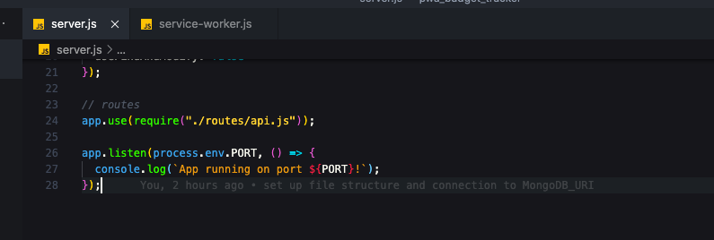

# pwa_budget_tracker

## Description
This is a budget tracker application that allows for offline access and functionality.

The user is able to add expenses and deposits to their budget with or without a connection.

Once the connection comes back online, the budget total will be updated with the updated balance.

## Deployed Application
This application is deployed on Heroku.

Check it out [here](https://pwa-budget-tracker-rf.herokuapp.com/).

## Contents
This application follows MVC file structure design which contains the following:

* Models - containing transaction.js
* Public - containing icons and images directories along with the following files. 
    [db.js, favicon.ico, index.html,index.js,manifest.webmanifest, service-worker.js, and styles.css]
* Routes - containing api.js
* .gitignore
* node modules
* package.json & package-lock.json
* instructions.md
* server.js

## Requirements
These are referenced within the [instructions.md](./instructions.md).

## Usage Information
Compression, Express, lite-server, mongoose, and morgan were the required npm packages utilized to build this application.

MongoDB Atlas supports the cloud database hosting.

## Challenges

Honestly the biggest challenge was getting the application to connect to Heroku.

I continually got an H10 error shown here...

After doing some research, I found that I needed to make my app.listen set up with 'process.env.PORT' shown here...

## Resources
In order to complete this project I referenced the MongoAtlas Deploy.md document and 10-23-2020 tutorial video provided by instructor, Jonathan Watson.

I also used the following resource on [Stack Overflow](https://stackoverflow.com/questions/14322989/first-heroku-deploy-failed-error-code-h10).

## Badge

## License
MIT Copyright 2020 - Ryan Flanagan

Permission is hereby granted, free of charge, to any person obtaining a copy of this software and associated documentation files (the "Software"), to deal in the Software without restriction, including without limitation the rights to use, copy, modify, merge, publish, distribute, sublicense, and/or sell copies of the Software, and to permit persons to whom the Software is furnished to do so, subject to the following conditions:

The above copyright notice and this permission notice shall be included in all copies or substantial portions of the Software.

THE SOFTWARE IS PROVIDED "AS IS", WITHOUT WARRANTY OF ANY KIND, EXPRESS OR IMPLIED, INCLUDING BUT NOT LIMITED TO THE WARRANTIES OF MERCHANTABILITY, FITNESS FOR A PARTICULAR PURPOSE AND NONINFRINGEMENT. IN NO EVENT SHALL THE AUTHORS OR COPYRIGHT HOLDERS BE LIABLE FOR ANY CLAIM, DAMAGES OR OTHER LIABILITY, WHETHER IN AN ACTION OF CONTRACT, TORT OR OTHERWISE, ARISING FROM, OUT OF OR IN CONNECTION WITH THE SOFTWARE OR THE USE OR OTHER DEALINGS IN THE SOFTWARE.